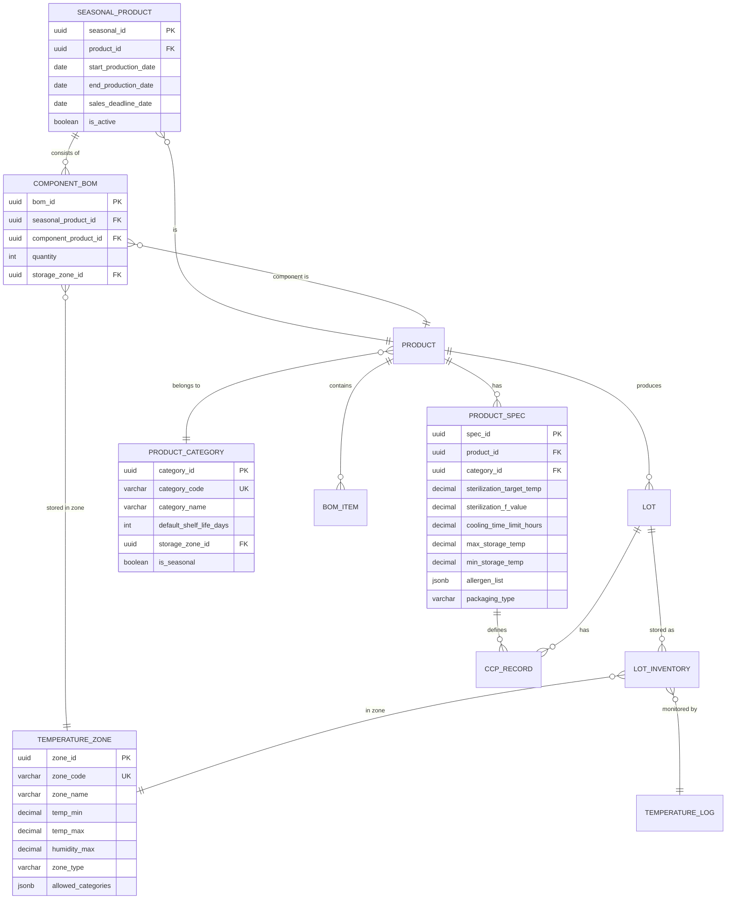

# 食品製造業MES - ER図（エンティティ関係図）

## 1. 概要
本ドキュメントは、食品製造業向けMESシステムのデータベース設計におけるエンティティ関係図を定義する。
Mermaid形式で可視化し、各エンティティの詳細属性も併記する。

---

## 2. 全体ER図（Mermaid）

```mermaid
erDiagram
    %% ===== 工場・ライン階層（マルチファクトリ対応）=====
    FACTORY {
        uuid factory_id PK
        string factory_code UK
        string factory_name
        string address
        string contact_email
        string phone
        string operating_hours
        boolean is_active
        date created_at
    }

    PRODUCTION_LINE {
        uuid line_id PK
        string line_code UK
        uuid factory_id FK
        string line_name
        string line_type (mixing/heating/packaging/filling/etc)
        integer max_throughput_per_hour
        jsonb capabilities
        boolean is_active
        date created_at
    }

    LINE_SHIFT {
        uuid shift_id PK
        uuid line_id FK
        string shift_name (morning/afternoon/night)
        time start_time
        time end_time
        integer max_batch_capacity
        jsonb operator_requirements
    }

    %% ===== ユーザー・権限 =====
    USER {
        uuid user_id PK
        uuid factory_id FK
        string login_id UK
        string name
        string email
        string password_hash
        date created_at
        date updated_at
        boolean is_active
    }

    ROLE {
        uuid role_id PK
        string role_name UK
        string description
    }

    USER_ROLE {
        uuid user_role_id PK
        uuid user_id FK
        uuid role_id FK
    }

    %% ===== マスタ管理 =====
    PRODUCT_MASTER {
        uuid product_id PK
        string sku_code UK
        string product_name
        string category
        string storage_condition
        date created_at
    }

    MATERIAL_MASTER {
        uuid material_id PK
        string sku_code UK
        string material_name
        string category
        boolean is_allergen
        jsonb allergen_types
        string storage_condition
        date created_at
    }

    BOM {
        uuid bom_id PK
        uuid product_id FK
        decimal version
        date effective_date
    }

    BOM_ITEM {
        uuid bom_item_id PK
        uuid bom_id FK
        uuid material_id FK
        decimal required_qty
        string unit
        boolean is_substitute_allowed
    }

    SUPPLIER {
        uuid supplier_id PK
        string supplier_code UK
        string supplier_name
        string contact_person
        string phone
        string address
        date certification_expiry
        boolean is_approved
    }

    %% ===== IoTセンサー =====
    IOT_SENSOR {
        uuid sensor_id PK
        string sensor_code UK
        uuid factory_id FK
        uuid line_id FK
        string sensor_type (temperature/humidity/pressure/weight/ph/conductivity/etc)
        string protocol (mqtt/opc-ua/http/tcp)
        jsonb configuration
        boolean is_active
        date last_calibration_date
        date next_calibration_date
        date created_at
    }

    SENSOR_RECORD {
        uuid record_id PK
        uuid sensor_id FK
        uuid factory_id FK
        uuid line_id FK
        timestamp recorded_at
        double precision value
        string unit (degC, %, kPa, g, pH, us/cm, etc)
        string status (OK/WARN/ALERT/OFFLINE)
        jsonb metadata
    }

   %% ===== 保管場所（工場階層対応）=====
    WAREHOUSE {
        uuid warehouse_id PK
        uuid factory_id FK
        string wh_code UK
        string wh_name
        string temperature_zone
        decimal total_volume
        decimal total_weight_capacity
        date created_at
    }

    ZONE {
        uuid zone_id PK
        uuid warehouse_id FK
        string zone_code
        string zone_name
        string temperature_override
    }

    SHELF {
        uuid shelf_id PK
        uuid zone_id FK
        string shelf_code UK
        decimal weight_limit_kg
        decimal volume_limit_l
        boolean is_active
    }

    BIN {
        uuid bin_id PK
        uuid shelf_id FK
        string bin_code UK
        decimal weight_capacity_kg
        boolean is_occupied
    }

       LOT {
        uuid lot_id PK
        uuid factory_id FK
        uuid line_id FK
        string lot_number UK
        uuid material_id FK
        uuid parent_lot_id FK
        date manufacturing_date
        date expiry_date
        decimal quantity
        string unit
        string status
        uuid supplier_id FK
        date received_date
        date created_at
    }

    LOT_LOCATION {
        uuid lot_location_id PK
        uuid lot_id FK
        uuid bin_id FK
        uuid factory_id FK
        decimal current_qty
        date moved_in_date
        date moved_out_date
    }

    STOCK_TRANSACTION {
        uuid transaction_id PK
        uuid lot_id FK
        uuid factory_id FK
        string transaction_type
        decimal quantity_delta
        date created_at
        uuid created_by_user_id FK
        string reference_doc_no
    }

    %% ===== 受入（Incoming） =====
    PURCHASE_ORDER {
        uuid po_id PK
        string po_number UK
        uuid supplier_id FK
        date order_date
        date expected_delivery_date
        string status
    }

    PO_ITEM {
        uuid po_item_id PK
        uuid po_id FK
        uuid material_id FK
        decimal ordered_qty
        string unit
    }

    RECEIPT {
        uuid receipt_id PK
        uuid factory_id FK
        string receipt_number UK
        uuid po_id FK
        date receipt_date
        string inspection_result
        uuid received_by_user_id FK
        date created_at
    }

    RECEIPT_ITEM {
        uuid receipt_item_id PK
        uuid factory_id FK
        uuid receipt_id FK
        uuid material_id FK
        decimal received_qty
        uuid lot_id FK
        boolean inspection_passed
        string coa_file_url
    }

    %% ===== 製造実行 =====
    PRODUCTION_ORDER {
        uuid production_order_id PK
        string order_number UK
        uuid factory_id FK
        uuid line_id FK
        uuid product_id FK
        uuid warehouse_id FK
        date planned_start_date
        date actual_start_date
        date planned_end_date
        date actual_end_date
        decimal planned_qty
        decimal actual_qty
        string status
        date created_at
    }

    PRODUCTION_ORDER_ITEM {
        uuid po_item_id PK
        uuid production_order_id FK
        uuid material_id FK
        uuid lot_id FK (source_lot)
        decimal allocated_qty
        decimal used_qty
    }

    PRODUCTION_BATCH {
        uuid batch_id PK
        uuid factory_id FK
        uuid line_id FK
        string batch_number UK
        uuid production_order_id FK
        date start_date
        date end_date
        decimal input_qty
        decimal output_qty
        decimal yield_rate
        date created_at
    }

    BATCH_LOT {
        uuid batch_lot_id PK
        uuid factory_id FK
        string lot_number UK
        uuid batch_id FK
        uuid product_id FK
        date manufacturing_date
        date expiry_date
        decimal quantity
        string status
    }

    %% ===== 工程フロー =====
    PROCESS_FLOW {
        uuid process_flow_id PK
        uuid factory_id FK
        uuid product_id FK
        string flow_name
        version_number
        date effective_date
    }

    PROCESS_STEP {
        uuid step_id PK
        uuid process_flow_id FK
        integer step_order
        string step_name
        string step_type
        boolean is_ccp
        boolean is_oprp
        jsonb ccp_parameters
    }

    %% ===== HACCP =====
    HACCP_PLAN {
        uuid haccp_plan_id PK
        uuid factory_id FK
        uuid warehouse_id FK
        string plan_version
        date effective_date
        date expiry_date
        string haccp_type
        boolean is_active
    }

    HAZARD_ANALYSIS {
        uuid hazard_id PK
        uuid haccp_plan_id FK
        uuid step_id FK
        string hazard_type (bio/chem/phys)
        string hazard_description
        integer severity_score
        integer probability_score
        boolean is_acceptable
    }

    CCP_MONITORING_RECORD {
        uuid record_id PK
        uuid factory_id FK
        uuid line_id FK
        uuid step_id FK
        uuid batch_id FK
        date monitoring_date
        jsonb measured_values (e.g. temperature, time)
        string result (OK/NG)
        uuid monitored_by_user_id FK
        date created_at
    }

    CCP_DEVIATION {
        uuid deviation_id PK
        uuid record_id FK
        date detected_at
        string deviation_description
        string corrective_action_taken
        decimal affected_quantity
        date resolved_at
        uuid resolved_by_user_id FK
    }

    PRE_REQUISITE_PROGRAM {
        uuid prp_id PK
        string program_type (cleaning/sanitation/pest_control/equipment/health)
        string description
        integer frequency_days
        boolean is_active
    }

    PRP_EXECUTION_RECORD {
        uuid record_id PK
        uuid prp_id FK
        date execution_date
        string result
        jsonb details
        uuid executed_by_user_id FK
    }

    EQUIPMENT_CALIBRATION {
        uuid cal_id PK
        uuid step_id FK
        date calibration_due_date
        date last_calibrated_date
        date next_calibration_date
        string calibration_result
        uuid calibrated_by_user_id FK
    }

    INTERNAL_AUDIT {
        uuid audit_id PK
        uuid haccp_plan_id FK
        string audit_type
        date scheduled_date
        date actual_date
        string finding
        string nonconformity_description
        string corrective_action
        string status
        uuid auditor_user_id FK
    }

    CAPA (Corrective_and_Preventive_Action) {
        uuid capa_id PK
        string reference_type (audit/deviation/ncr)
        string reference_id
        string description
        string root_cause_analysis
        string corrective_action_plan
        date due_date
        date completed_date
        string status
    }

    %% ===== 品質管理 =====
    INSPECTION_SPEC {
        uuid spec_id PK
        uuid material_id FK (null if product)
        uuid product_id FK (null if material)
        string spec_type (incoming/in_process/final)
        date effective_date
    }

    SPEC_ITEM {
        uuid spec_item_id PK
        uuid spec_id FK
        string item_name
        string measurement_unit
        decimal min_limit
        decimal max_limit
        string target_value
    }

    INSPECTION_RESULT {
        uuid result_id PK
        uuid lot_id FK
        uuid spec_id FK
        date inspection_date
        uuid inspector_user_id FK
    }

    RESULT_ITEM {
        uuid item_result_id PK
        uuid result_id FK
        uuid spec_item_id FK
        decimal measured_value
        string judgment (OK/NG)
        string note
    }

    NCR (Non_Conformance_Report) {
        uuid ncr_id PK
        string ncr_number UK
        uuid lot_id FK
        string cause_category
        string description
        date reported_date
        uuid reported_by_user_id FK
        string disposition (scrap/rework/return_to_supplier)
        date resolved_date
    }

    PRODUCT_RECALL {
        uuid recall_id PK
        string recall_number UK
        string recall_reason
        uuid affected_product_id FK
        date announcement_date
        date target_expiry_start
        date target_expiry_end
        string status (active/closed)
        decimal total_units_affected
        decimal total_units_recalled
    }

    %% ===== 出荷（Shipping） =====
    SHIPMENT_ORDER {
        uuid shipment_id PK
        uuid factory_id FK
        string shipment_number UK
        string customer_name
        date shipment_date
        delivery_address
        string status
        date created_at
    }

    SHIPMENT_ITEM {
        uuid item_id PK
        uuid factory_id FK
        uuid shipment_id FK
        uuid product_id FK
        uuid lot_id FK (batch_lot_id)
        decimal shipped_qty
        date actual_shipped_date
    }

    %% ===== IF連携ログ =====
    INTEGRATION_CONFIG {
        uuid config_id PK
        string integration_name UK
        string target_system (ERP/WMS/LIMS/HR/PRINTER/IoT)
        string endpoint_url
        jsonb auth_config
        string data_format (JSON/CSV/XML/EDI)
        boolean is_active
        integer retry_count
        integer retry_delay_seconds
    }

    INTEGRATION_LOG {
        uuid log_id PK
        uuid config_id FK
        string direction (outbound/inbound)
        string entity_type
        jsonb request_payload
        jsonb response_payload
        integer http_status_code
        string error_message
        timestamp started_at
        timestamp finished_at
        integer duration_ms
    }

   %% ===== 監査証跡 =====
    AUDIT_LOG {
        uuid audit_log_id PK
        string entity_type
        uuid entity_id
        string action (CREATE/UPDATE/DELETE)
        jsonb previous_values
        jsonb new_values
        date timestamp
        uuid user_id FK
        string ip_address
        string hash_chain
    }

    %% ===== リレーションシップ =====

    USER ||--o{ USER_ROLE : has
    ROLE ||--o{ USER_ROLE : assigned_to

    PRODUCT_MASTER ||--o{ BOM : contains
    BOM ||--|{ BOM_ITEM : consists_of
    MATERIAL_MASTER ||--o{ BOM_ITEM : referenced_by
    SUPPLIER ||--o{ PURCHASE_ORDER : issues
    PURCHASE_ORDER ||--o{ PO_ITEM : includes

    WAREHOUSE ||--o{ ZONE : contains
    ZONE ||--o{ SHELF : has
    SHELF ||--o{ BIN : consists_of

    LOT }o--o| MATERIAL_MASTER : belongs_to
    LOT }o--o| LOT : splits_from (parent_lot)
    LOT_LOCATION }o--|| LOT : stores
    LOT_LOCATION }o--|| BIN : located_in

    STOCK_TRANSACTION }o--|| LOT : affects
    RECEIPT ||--o{ RECEIPT_ITEM : contains
    RECEIPT_ITEM }o--|| PURCHASE_ORDER : references
    RECEIPT_ITEM }o--|| LOT : generates

    PRODUCTION_ORDER ||--o{ PRODUCTION_ORDER_ITEM : requires
    PRODUCTION_ORDER ||--o{ PRODUCTION_BATCH : produces
    PRODUCTION_ORDER_ITEM }o--|| MATERIAL_MASTER : uses_material
    PRODUCTION_ORDER_ITEM }o--|| LOT : consumes_lot

    BATCH_LOT }o--|| PRODUCTION_BATCH : produced_by
    BATCH_LOT ||--o{ SHIPMENT_ITEM : shipped_as

    PROCESS_FLOW ||--o{ PROCESS_STEP : contains
    PROCESS_STEP ||--o{ HAZARD_ANALYSIS : analyzed_for
    PROCESS_STEP ||--o{ CCP_MONITORING_RECORD : monitored_by

    HACCP_PLAN }o--|| WAREHOUSE : belongs_to
    HACCP_PLAN ||--o{ HAZARD_ANALYSIS : contains
    HACCP_PLAN ||--o{ PRE_REQUISITE_PROGRAM : includes
    PRE_REQUISITE_PROGRAM ||--o{ PRP_EXECUTION_RECORD : executed

    CCP_MONITORING_RECORD ||--o| CCP_DEVIATION : may_trigger
    EQUIPMENT_CALIBRATION }o--|| PROCESS_STEP : calibrates

    INTERNAL_AUDIT }o--|| HACCP_PLAN : audits
    INTERNAL_AUDIT ||--o| CAPA : generates
    CCP_DEVIATION ||--o| CAPA : generates

    INSPECTION_SPEC ||--o{ SPEC_ITEM : defines
    SPEC_ITEM ||--o{ RESULT_ITEM : has_results
    INSPECTION_RESULT }o--|| INSPECTION_SPEC : follows_spec
    INSPECTION_RESULT }o--|| LOT : inspects
    RESULT_ITEM }o--|| SPEC_ITEM : measures

    NCR }o--|| LOT : reports_on
    NCR ||--o| CAPA : generates

    SHIPMENT_ORDER ||--o{ SHIPMENT_ITEM : contains

    %% ===== 工場・ライン階層リレーションシップ =====
    FACTORY ||--o{ PRODUCTION_LINE : operates
    FACTORY ||--o{ WAREHOUSE : has
    FACTORY ||--o{ LOT : produces
    FACTORY ||--o{ RECEIPT : receives_at
    FACTORY ||--o{ SHIPMENT_ORDER : ships_from
    FACTORY ||--o{ PROCESS_FLOW : owns
    FACTORY ||--o{ HACCP_PLAN : manages

    PRODUCTION_LINE ||--o{ LINE_SHIFT : runs
    PRODUCTION_LINE ||--o{ IOT_SENSOR : has
    PRODUCTION_LINE ||--|| PRODUCTION_ORDER : executes
    PRODUCTION_LINE ||--o{ PRODUCTION_BATCH : produces
    PRODUCTION_LINE ||--o{ CCP_MONITORING_RECORD : monitors

    USER }o--|| FACTORY : belongs_to

    %% ===== トランザクション共通リレーションシップ =====
    LOT }o--|| MATERIAL_MASTER : is_material
    LOT ||--o{ LOT : splits_into (child lots)
    LOT ||--o| LOT : parent_of (split from)
    LOT_LOCATION }o--|| LOT : stores_location
    LOT_LOCATION }o--|| BIN : located_in
    STOCK_TRANSACTION }o--|| LOT : affects_lot

    RECEIPT }o--|| PURCHASE_ORDER : fulfills_po
    RECEIPT_ITEM }o--|| RECEIPT : item_of
    RECEIPT_ITEM }o--|| LOT : creates_lot (on receipt)

    PRODUCTION_ORDER ||--o{ PRODUCTION_ORDER_ITEM : requires_materials
    PRODUCTION_ORDER_ITEM }o--|| MATERIAL_MASTER : needs
    PRODUCTION_ORDER_ITEM }o--|| LOT : consumes_from

    BATCH_LOT ||--o{ SHIPMENT_ITEM : shipped_as_product
    BATCH_LOT ||--|| PRODUCTION_BATCH : produced_by

    %% ===== HACCP・品質関連リレーションシップ =====
    PROCESS_FLOW ||--o{ PROCESS_STEP : contains_steps
    PROCESS_STEP ||--o{ HAZARD_ANALYSIS : analyzed
    PROCESS_STEP ||--o{ CCP_MONITORING_RECORD : monitored
    PROCESS_STEP ||--o{ EQUIPMENT_CALIBRATION : requires_calibration
    SENSOR_RECORD ||--o{ CCP_MONITORING_RECORD : auto_records (IoT feed)

    HACCP_PLAN ||--o{ HAZARD_ANALYSIS : contains_hazards
    HACCP_PLAN ||--o{ PRE_REQUISITE_PROGRAM : includes_prp

    INTERNAL_AUDIT }o--|| HACCP_PLAN : audits_plan
    INTERNAL_AUDIT ||--o| CAPA : generates_capa
    CCP_DEVIATION ||--o| CAPA : triggers_capa
    NCR ||--o| CAPA : creates_capa

    INSPECTION_SPEC ||--o{ SPEC_ITEM : defines_specs
    INSPECTION_RESULT }o--|| INSPECTION_SPEC : follows_spec
    INSPECTION_RESULT }o--|| LOT : inspects_lot
    RESULT_ITEM }o--|| INSPECTION_RESULT : result_of
    RESULT_ITEM }o--|| SPEC_ITEM : spec_item

    PRODUCT_RECALL ||--o{ BATCH_LOT : recalls_products
    PRODUCT_RECALL ||--o{ SHIPMENT_ORDER : affected_shipments

    %% ===== IF連携リレーションシップ =====
    INTEGRATION_CONFIG ||--o{ INTEGRATION_LOG : tracks

    %% ===== 工場・ライン階層リレーションシップ =====
    FACTORY ||--o{ PRODUCTION_LINE : operates
    FACTORY ||--o{ WAREHOUSE : has
    PRODUCTION_LINE ||--o{ LINE_SHIFT : runs
    USER }o--|| FACTORY : belongs_to
    IOT_SENSOR }o--|| FACTORY : located_at
    IOT_SENSOR }o--|| PRODUCTION_LINE : monitors

    %% ===== IF連携リレーションシップ =====
    INTEGRATION_CONFIG ||--o{ INTEGRATION_LOG : tracks

    %% ===== 既存エンティティの拡張 (factory_id/line_id) =====
    LOT }o--|| FACTORY : belongs_to
    RECEIPT }o--|| FACTORY : occurs_at
    PRODUCTION_ORDER }o--|| FACTORY : executed_at
    PRODUCTION_ORDER ||--o{ PRODUCTION_LINE : assigned_to
    BATCH_LOT }o--|| FACTORY : produced_in
    SHIPMENT_ORDER }o--|| FACTORY : shipped_from
    PROCESS_FLOW }o--|| FACTORY : belongs_to
    HACCP_PLAN }o--|| FACTORY : belongs_to
    AUDIT_LOG }o--|| FACTORY : occurred_at

    %% ===== IoTセンサーリレーションシップ =====
    SENSOR_RECORD }o--|| IOT_SENSOR : generated_by

    %% ===== センサー記録からCCP監視への関連 =====
    SENSOR_RECORD ||--o{ CCP_MONITORING_RECORD : feeds_into (auto)
```

---

## 3. エンティティ詳細定義

### 3.1 ユーザー・権限

#### USER（ユーザー）
| カラム | 型 | 制約 | 説明 |
|--------|-----|------|------|
| user_id | UUID | PK | ユーザー固有ID |
| login_id | VARCHAR(50) | UK, NOT NULL | ログインID |
| name | VARCHAR(100) | NOT NULL | 氏名 |
| email | VARCHAR(255) | | メールアドレス |
| password_hash | VARCHAR(255) | NOT NULL | ハッシュ化されたパスワード |
| created_at | TIMESTAMP | DEFAULT NOW() | 作成日時 |
| updated_at | TIMESTAMP | | 更新日時 |
| is_active | BOOLEAN | DEFAULT TRUE | アクティブフラグ |

#### ROLE（ロール）
| カラム | 型 | 制約 | 説明 |
|--------|-----|------|------|
| role_id | UUID | PK | ロールID |
| role_name | VARCHAR(50) | UK, NOT NULL | ロール名 |
| description | TEXT | | 役割の説明 |

**预设ロール:**
- `admin`: システム管理者（全権限）
- `production_manager`: 生産マネージャー（製造指示・実績入力）
- `warehouse_staff`: 倉庫担当者（在庫操作）
- `haccp_officer`: HACCP責任者（HACCP管理・CCP監視）
- `quality_inspector`: 品質検査員（検査実施）
- `maintenance_staff`: 設備保守担当
- `auditor`: 監査人（参照特化）

---

### 3.2 マスタ

#### MATERIAL_MASTER（原材料マスタ）
| カラム | 型 | 制約 | 説明 |
|--------|-----|------|------|
| material_id | UUID | PK | 原材料ID |
| sku_code | VARCHAR(50) | UK, NOT NULL | SKUコード |
| material_name | VARCHAR(200) | NOT NULL | 原材料名 |
| category | VARCHAR(50) | NOT NULL | 区分（原材料/添加物/包装資材/副資材） |
| is_allergen | BOOLEAN | DEFAULT FALSE | アレルゲンフラグ |
| allergen_types | JSONB | | アレルゲン種類（28品目） |
| storage_condition | VARCHAR(50) | NOT NULL | 保存条件（常温/冷蔵/冷凍/特冷） |

#### PRODUCT_MASTER（製品マスタ）
| カラム | 型 | 制約 | 説明 |
|--------|-----|------|------|
| product_id | UUID | PK | 製品ID |
| sku_code | VARCHAR(50) | UK, NOT NULL | SKUコード |
| product_name | VARCHAR(200) | NOT NULL | 製品名 |
| category | VARCHAR(50) | NOT NULL | 製品カテゴリ |
| storage_condition | VARCHAR(50) | NOT NULL | 保存条件 |

#### SUPPLIER（サプライヤー）
| カラム | 型 | 制約 | 説明 |
|--------|-----|------|------|
| supplier_id | UUID | PK | サプライヤーID |
| supplier_code | VARCHAR(50) | UK, NOT NULL | サプライヤーコード |
| supplier_name | VARCHAR(200) | NOT NULL | 会社名 |
| contact_person | VARCHAR(100) | | 担当者 |
| phone | VARCHAR(50) | | 電話番号 |
| address | TEXT | | 住所 |
| certification_expiry | DATE | | 認証有効期限（ISO22000等） |
| is_approved | BOOLEAN | DEFAULT TRUE | 承認状態 |

---

### 3.3 BOM・工程フロー

#### BOM（部品表）
| カラム | 型 | 制約 | 説明 |
|--------|-----|------|------|
| bom_id | UUID | PK | BOM ID |
| product_id | UUID | FK → PRODUCT_MASTER | 製品ID |
| version | DECIMAL(5,2) | NOT NULL | バージョン番号 |
| effective_date | DATE | NOT NULL | 有効開始日 |

#### BOM_ITEM（BOM明细）
| カラム | 型 | 制約 | 説明 |
|--------|-----|------|------|
| bom_item_id | UUID | PK | BOM明細ID |
| bom_id | UUID | FK → BOM | BOM ID |
| material_id | UUID | FK → MATERIAL_MASTER | 原材料ID |
| required_qty | DECIMAL(10,3) | NOT NULL | 必要数量 |
| unit | VARCHAR(20) | NOT NULL | 単位 |
| is_substitute_allowed | BOOLEAN | DEFAULT FALSE | 代替品許可 |

#### PROCESS_FLOW（工程フロー）
| カラム | 型 | 制約 | 説明 |
|--------|-----|------|------|
| process_flow_id | UUID | PK | 工程フローID |
| product_id | UUID | FK → PRODUCT_MASTER | 製品ID |
| flow_name | VARCHAR(200) | NOT NULL | フロー名 |
| version | INTEGER | DEFAULT 1 | バージョン |

#### PROCESS_STEP（工程ステップ）
| カラム | 型 | 制約 | 説明 |
|--------|-----|------|------|
| step_id | UUID | PK | 工程ID |
| process_flow_id | UUID | FK → PROCESS_FLOW | フローID |
| step_order | INTEGER | NOT NULL | ステップ順序 |
| step_name | VARCHAR(200) | NOT NULL | 工程名 |
| step_type | VARCHAR(50) | NOT NULL | タイプ（mixing/heating/packaging等） |
| is_ccp | BOOLEAN | DEFAULT FALSE | CCPフラグ |
| is_oprp | BOOLEAN | DEFAULT FALSE | OPRPフラグ |
| ccp_parameters | JSONB | | CCPパラメータ（温度/時間等の定義） |

---

### 3.4 保管場所

#### WAREHOUSE（倉庫）
| カラム | 型 | 制約 | 説明 |
|--------|-----|------|------|
| warehouse_id | UUID | PK | 倉庫ID |
| wh_code | VARCHAR(20) | UK, NOT NULL | 倉庫コード |
| wh_name | VARCHAR(200) | NOT NULL | 倉庫名 |
| temperature_zone | VARCHAR(50) | NOT NULL | 温度帯（常温/冷蔵/冷凍/特冷） |
| total_volume | DECIMAL(10,2) | | 総容積(L) |
| total_weight_capacity | DECIMAL(10,2) | | 総重量容量(kg) |

#### ZONE（ゾーン）
| カラム | 型 | 制約 | 説明 |
|--------|-----|------|------|
| zone_id | UUID | PK | ゾーンID |
| warehouse_id | UUID | FK → WAREHOUSE | 倉庫ID |
| zone_code | VARCHAR(20) | NOT NULL | ゾーンコード |
| zone_name | VARCHAR(100) | | ゾーン名 |
| temperature_override | VARCHAR(50) | | 温度帯上書き（NULLなら親倉庫を継承） |

#### SHELF（棚）
| カラム | 型 | 制約 | 説明 |
|--------|-----|------|------|
| shelf_id | UUID | PK | 棚ID |
| zone_id | UUID | FK → ZONE | ゾーンID |
| shelf_code | VARCHAR(20) | NOT NULL | 棚コード（例: A-01-03） |

#### BIN（保管位置）
| カラム | 型 | 制約 | 説明 |
|--------|-----|------|------|
| bin_id | UUID | PK | バインID |
| shelf_id | UUID | FK → SHELF | 棚ID |
| bin_code | VARCHAR(20) | NOT NULL | 位置コード |

---

### 3.5 ロット・在庫

#### LOT（ロット）
| カラム | 型 | 制約 | 説明 |
|--------|-----|------|------|
| lot_id | UUID | PK | ロットID |
| lot_number | VARCHAR(50) | UK, NOT NULL | ロット番号（例: LOT-R-20260514-001） |
| material_id | UUID | FK → MATERIAL_MASTER | 原材料ID |
| parent_lot_id | UUID | FK → LOT (self) | 親ロットID（分割元） |
| manufacturing_date | DATE | NOT NULL | 製造日 |
| expiry_date | DATE | NOT NULL | 有効期限 |
| quantity | DECIMAL(10,3) | NOT NULL | 数量 |
| unit | VARCHAR(20) | NOT NULL | 単位 |
| status | VARCHAR(50) | NOT NULL | ステータス（new/received/producing/in_stock/shipped/disposed） |
| supplier_id | UUID | FK → SUPPLIER | サプライヤーID |

#### LOT_LOCATION（ロット保管位置）
| カラム | 型 | 制約 | 説明 |
|--------|-----|------|------|
| lot_location_id | UUID | PK | 保管位置ID |
| lot_id | UUID | FK → LOT | ロットID |
| bin_id | UUID | FK → BIN | バインID |
| current_qty | DECIMAL(10,3) | NOT NULL | 現在数量 |
| moved_in_date | TIMESTAMP | DEFAULT NOW() | 移動日時 |

#### STOCK_TRANSACTION（在庫取引）
| カラム | 型 | 制約 | 説明 |
|--------|-----|------|------|
| transaction_id | UUID | PK | 取引ID |
| lot_id | UUID | FK → LOT | ロットID |
| transaction_type | VARCHAR(50) | NOT NULL | タイプ（receipt/issue/transfer/split/disposal/adjustment） |
| quantity_delta | DECIMAL(10,3) | NOT NULL | 数量増減（+/-） |
| created_at | TIMESTAMP | DEFAULT NOW() | 作成日時 |
| created_by_user_id | UUID | FK → USER | 操作者 |
| reference_doc_no | VARCHAR(50) | | 関連文書番号 |

---

### 3.6 受入・発注

#### PURCHASE_ORDER（発注書）
| カラム | 型 | 制約 | 説明 |
|--------|-----|------|------|
| po_id | UUID | PK | PO ID |
| po_number | VARCHAR(50) | UK, NOT NULL | PO番号 |
| supplier_id | UUID | FK → SUPPLIER | サプライヤーID |
| order_date | DATE | NOT NULL | 発注日 |
| expected_delivery_date | DATE | | 納期予定日 |
| status | VARCHAR(50) | DEFAULT 'pending' | 状態（pending/received/cancelled） |

#### RECEIPT（受入伝票）
| カラム | 型 | 制約 | 説明 |
|--------|-----|------|------|
| receipt_id | UUID | PK | 受入ID |
| receipt_number | VARCHAR(50) | UK, NOT NULL | 受入番号 |
| po_id | UUID | FK → PURCHASE_ORDER | PO ID（NULLの場合あり） |
| receipt_date | DATE | NOT NULL | 受入日 |
| inspection_result | VARCHAR(20) | | 検収結果 |
| received_by_user_id | UUID | FK → USER | 担当者 |

---

### 3.7 製造実行

#### PRODUCTION_ORDER（生産指示書）
| カラム | 型 | 制約 | 説明 |
|--------|-----|------|------|
| production_order_id | UUID | PK | 指示書ID |
| order_number | VARCHAR(50) | UK, NOT NULL | 指示番号 |
| product_id | UUID | FK → PRODUCT_MASTER | 製品ID |
| warehouse_id | UUID | FK → WAREHOUSE | 倉庫ID |
| planned_start_date | DATE | | 計画開始日 |
| actual_start_date | TIMESTAMP | | 実際開始日時 |
| planned_end_date | DATE | | 計画終了日 |
| actual_end_date | TIMESTAMP | | 実際終了日時 |
| planned_qty | DECIMAL(10,3) | NOT NULL | 計画数量 |
| actual_qty | DECIMAL(10,3) | | 実際数量 |
| status | VARCHAR(50) | DEFAULT 'planned' | 状態（planned/released/in_progress/completed/cancelled） |

#### PRODUCTION_BATCH（バッチ）
| カラム | 型 | 制約 | 説明 |
|--------|-----|------|------|
| batch_id | UUID | PK | バッチID |
| batch_number | VARCHAR(50) | UK, NOT NULL | バッチ番号 |
| production_order_id | UUID | FK → PRODUCTION_ORDER | 指示書ID |
| start_date | TIMESTAMP | NOT NULL | 開始日時 |
| end_date | TIMESTAMP | | 終了日時 |
| input_qty | DECIMAL(10,3) | NOT NULL | 投入数量 |
| output_qty | DECIMAL(10,3) | | 完成数量 |
| yield_rate | DECIMAL(5,2) | | 歩留まり率(%) |

#### BATCH_LOT（完成品ロット）
| カラム | 型 | 制約 | 説明 |
|--------|-----|------|------|
| batch_lot_id | UUID | PK | 完成品ロットID |
| lot_number | VARCHAR(50) | UK, NOT NULL | ロット番号（LOT-FG-YYYYMMDD-XXX） |
| batch_id | UUID | FK → PRODUCTION_BATCH | バッチID |
| product_id | UUID | FK → PRODUCT_MASTER | 製品ID |
| manufacturing_date | DATE | NOT NULL | 製造日 |
| expiry_date | DATE | NOT NULL | 有効期限 |
| quantity | DECIMAL(10,3) | NOT NULL | 完成数量 |
| status | VARCHAR(50) | DEFAULT 'produced' | ステータス |

---

### 3.8 HACCP

#### HACCP_PLAN（HACCP計画）
| カラム | 型 | 制約 | 説明 |
|--------|-----|------|------|
| haccp_plan_id | UUID | PK | HACCP計画ID |
| warehouse_id | UUID | FK → WAREHOUSE | 対象倉庫（工場） |
| plan_version | VARCHAR(20) | NOT NULL | バージョン |
| effective_date | DATE | NOT NULL | 有効日 |
| expiry_date | DATE | | 有効期限 |
| haccp_type | VARCHAR(50) | NOT NULL | HACCPタイプ（①/②/③） |

#### HAZARD_ANALYSIS（危害要因分析）
| カラム | 型 | 制約 | 説明 |
|--------|-----|------|------|
| hazard_id | UUID | PK | 分析ID |
| haccp_plan_id | UUID | FK → HACCP_PLAN | HACCP計画ID |
| step_id | UUID | FK → PROCESS_STEP | 工程ID |
| hazard_type | VARCHAR(10) | NOT NULL | 種類（B=生物/C=化学/P=物理） |
| hazard_description | TEXT | NOT NULL | 説明 |
| severity_score | INTEGER | | 重大性スコア（1-5） |
| probability_score | INTEGER | | 発生確率スコア（1-5） |
| is_acceptable | BOOLEAN | | 許容可否 |

#### CCP_MONITORING_RECORD（CCP監視記録）
| カラム | 型 | 制約 | 説明 |
|--------|-----|------|------|
| record_id | UUID | PK | 記録ID |
| step_id | UUID | FK → PROCESS_STEP (CCP) | CCP工程ID |
| batch_id | UUID | FK → PRODUCTION_BATCH | バッチID |
| monitoring_date | TIMESTAMP | NOT NULL | 監視日時 |
| measured_values | JSONB | NOT NULL | 実測値（温度,時間,pH等） |
| result | VARCHAR(10) | NOT NULL | 判定（OK/NG） |
| monitored_by_user_id | UUID | FK → USER | 担当者 |

#### CCP_DEVIATION（CCP逸脱）
| カラム | 型 | 制約 | 説明 |
|--------|-----|------|------|
| deviation_id | UUID | PK | 逸脱ID |
| record_id | UUID | FK → CCP_MONITORING_RECORD | 監視記録ID |
| detected_at | TIMESTAMP | NOT NULL | 検知日時 |
| deviation_description | TEXT | NOT NULL | 逸脱内容 |
| corrective_action_taken | TEXT | | 是正措置 |
| affected_quantity | DECIMAL(10,3) | | 影響数量 |

#### PRE_REQUISITE_PROGRAM（実施衛生プログラム）
| カラム | 型 | 制約 | 説明 |
|--------|-----|------|------|
| prp_id | UUID | PK | プログラムID |
| program_type | VARCHAR(50) | NOT NULL | タイプ（cleaning/sanitation/pest_control/equipment/health） |
| description | TEXT | | 説明 |
| frequency_days | INTEGER | | 実施頻度（日数） |

---

### 3.9 品質管理

#### INSPECTION_SPEC（検査規格）
| カラム | 型 | 制約 | 説明 |
|--------|-----|------|------|
| spec_id | UUID | PK | 規格ID |
| material_id | UUID | FK → MATERIAL_MASTER | 原材料ID |
| product_id | UUID | FK → PRODUCT_MASTER | 製品ID |
| spec_type | VARCHAR(50) | NOT NULL | タイプ（incoming/in_process/final） |

#### SPEC_ITEM（検査項目）
| カラム | 型 | 制約 | 説明 |
|--------|-----|------|------|
| spec_item_id | UUID | PK | 規格項目ID |
| spec_id | UUID | FK → INSPECTION_SPEC | 規格ID |
| item_name | VARCHAR(200) | NOT NULL | 項目名 |
| measurement_unit | VARCHAR(20) | | 単位 |
| min_limit | DECIMAL(10,3) | | 下限値 |
| max_limit | DECIMAL(10,3) | | 上限値 |

#### INSPECTION_RESULT（検査結果）
| カラム | 型 | 制約 | 説明 |
|--------|-----|------|------|
| result_id | UUID | PK | 結果ID |
| lot_id | UUID | FK → LOT / BATCH_LOT | ロットID |
| spec_id | UUID | FK → INSPECTION_SPEC | 規格ID |
| inspection_date | TIMESTAMP | NOT NULL | 検査日時 |
| inspector_user_id | UUID | FK → USER | 検査員 |

#### NCR（不適合品報告）
| カラム | 型 | 制約 | 説明 |
|--------|-----|------|------|
| ncr_id | UUID | PK | NCR ID |
| ncr_number | VARCHAR(50) | UK, NOT NULL | NCR番号 |
| lot_id | UUID | FK → LOT / BATCH_LOT | ロットID |
| cause_category | VARCHAR(50) | | 原因分類 |
| description | TEXT | NOT NULL | 内容 |
| disposition | VARCHAR(50) | | 処分方法（scrap/rework/return） |

---

### 3.10 出荷・リコール

#### SHIPMENT_ORDER（出荷指示書）
| カラム | 型 | 制約 | 説明 |
|--------|-----|------|------|
| shipment_id | UUID | PK | 出荷ID |
| shipment_number | VARCHAR(50) | UK, NOT NULL | 出荷番号 |
| customer_name | VARCHAR(200) | NOT NULL | 顧客名 |
| shipment_date | DATE | | 出荷日 |

#### SHIPMENT_ITEM（出荷明細）
| カラム | 型 | 制約 | 説明 |
|--------|-----|------|------|
| item_id | UUID | PK | 明細ID |
| shipment_id | UUID | FK → SHIPMENT_ORDER | 出荷ID |
| product_id | UUID | FK → PRODUCT_MASTER | 製品ID |
| lot_id | UUID | FK → BATCH_LOT | ロットID（完成品） |
| shipped_qty | DECIMAL(10,3) | NOT NULL | 出荷数量 |

#### PRODUCT_RECALL（製品回収）
| カラム | 型 | 制約 | 説明 |
|--------|-----|------|------|
| recall_id | UUID | PK | リコールID |
| recall_number | VARCHAR(50) | UK, NOT NULL | リコール番号 |
| recall_reason | TEXT | NOT NULL | リコール理由 |
| affected_product_id | UUID | FK → PRODUCT_MASTER | 影響製品 |
| total_units_affected | DECIMAL(10,3) | | 影響総数 |
| total_units_recalled | DECIMAL(10,3) | DEFAULT 0 | 回収済み数 |

---

### 3.11 監査証跡

#### AUDIT_LOG（監査ログ）
| カラム | 型 | 制約 | 説明 |
|--------|-----|------|------|
| audit_log_id | UUID | PK | ログID |
| entity_type | VARCHAR(50) | NOT NULL | エンティティ種別 |
| entity_id | UUID | NOT NULL | エンティティID |
| action | VARCHAR(10) | NOT NULL | 操作（CREATE/UPDATE/DELETE） |
| previous_values | JSONB | | 変更前値 |
| new_values | JSONB | | 変更後値 |
| timestamp | TIMESTAMP | DEFAULT NOW() | タイムスタンプ |
| user_id | UUID | FK → USER | ユーザーID |
| ip_address | VARCHAR(45) | | IPアドレス |
| hash_chain | VARCHAR(64) | NOT NULL | SHA-256ハッシュチェーン |

---

## 4. 主要インデックス設計

```sql
-- ロット関連の高速検索用
CREATE INDEX idx_lot_expiry_date ON LOT(expiry_date);
CREATE INDEX idx_lot_status ON LOT(status);
CREATE INDEX idx_lot_material_id ON LOT(material_id);
CREATE INDEX idx_lot_parent_lot_id ON LOT(parent_lot_id);
CREATE INDEX idx_lot_number ON LOT(lot_number);

-- FIFO検索用（特定の原材料で、期限が早い順）
CREATE INDEX idx_lot_fIFO ON LOT(material_id, expiry_date, manufacturing_date)
  WHERE status = 'in_stock';

-- 保管位置追跡用
CREATE INDEX idx_lot_location_bin ON LOT_LOCATION(bin_id);
CREATE INDEX idx_lot_location_lot ON LOT_LOCATION(lot_id);

-- HACCP監査用
CREATE INDEX idx_ccp_monitoring_batch ON CCP_MONITORING_RECORD(batch_id);
CREATE INDEX idx_ccp_monitoring_step ON CCP_MONITORING_RECORD(step_id);
CREATE INDEX idx_hazard_analysis_step ON HAZARD_ANALYSIS(step_id);

-- 監査証跡用
CREATE INDEX idx_audit_log_entity ON AUDIT_LOG(entity_type, entity_id);
CREATE INDEX idx_audit_log_timestamp ON AUDIT_LOG(timestamp);

-- トレーサビリティ用
CREATE INDEX idx_production_order_product ON PRODUCTION_ORDER(product_id);
CREATE INDEX idx_batch_lot_batch ON BATCH_LOT(batch_id);
CREATE INDEX idx_shipment_item_lot ON SHIPMENT_ITEM(lot_id);
```

---

## 5. テキスト形式 ER図（簡易版）

```
┌─────────┐     ┌──────────────┐     ┌──────────────┐
│  USER   │     │    ROLE      │     │USER_ROLE     │
├─────────┤     ├──────────────┤     ├──────────────┤
│*user_id *PK*│   │*role_id *PK* │     │*user_role_id*PK*│
│ login_id  │1──<│ role_name   │    │  *user_id*   FK>─1
│ name      │   └──────────────┘    │  *role_id*   FK>─1
└─────────┘                          └──────────────┘

┌────────────────┐     ┌──────────────┐
│SUPPLIER        │1──<│ PURCHASE_ORDER│
├────────────────┤     ├──────────────┤
│*supplier_id *PK*│    │*po_id   *PK* │
│ supplier_code  │     │ po_number    │
│ supplier_name  │     │ supplier_id* │FK>
└────────────────┘     └──────┬───────┘
                              │
                     ┌────────▼────────┐
                     │   PO_ITEM        │
                     ├──────────────────┤
                     │*po_item_id *PK*  │
                     │ po_id       *FK* │
                     │ material_id *FK* │
                     │ ordered_qty      │
                     └────────┬─────────┘
                              │
                     ┌────────▼────────┐
                     │ RECEIPT          │
                     ├──────────────────┤
                     │*receipt_id*PK*   │
                     │ receipt_number   │
                     │ po_id        *FK │
                     │ receipt_date     │
                     │ inspection_result│
                     └────────┬─────────┘
                              │
                     ┌────────▼────────┐
                     │ RECEIPT_ITEM     │
                     ├──────────────────┤
                     │*rpt_item_id*PK*  │
                     │ receipt_id *FK*  │
                     │ material_id *FK* │
                     │ received_qty     │
                     │ lot_id       *FK │ ← LOT生成
                     └────────┬─────────┘

┌────────────────┐
│ MATERIAL_MASTER │     ┌──────────────┐
├────────────────┤1──<│    LOT        │
│*material_id*PK*│    ├──────────────┤
│ sku_code       │    │*lot_id   *PK* │
│ material_name  │    │ lot_number    │
│ is_allergen    │    │ material_id*FK│
│ allergen_types │    │ parent_lot_id*FK→LOT(自己参照)│
└────────────────┘    │ manufacturing_date│
                      │ expiry_date     │
                      │ quantity        │
                      │ status          │
                      └───────┬─────────┘
                              │ 1:N
                     ┌────────▼─────────┐
                     │ LOT_LOCATION      │
                     ├───────────────────┤
                     │*loc_id    *PK*    │
                     │ lot_id       *FK* │
                     │ bin_id       *FK* │
                     │ current_qty       │
                     └────────┬──────────┘
                              │
                     ┌────────▼─────────┐
                     │ BIN               │
                     ├───────────────────┤
                     │*bin_id    *PK*    │
                     │ shelf_id     *FK* │
                     │ bin_code          │
                     └────────┬──────────┘

┌────────────────┐     ┌─────────────────────┐
│ PRODUCT_MASTER  │1──<│ PRODUCTION_ORDER     │
├────────────────┤     ├─────────────────────┤
│*product_id *PK*│    │*prod_order_id*PK*   │
│ sku_code       │    │ order_number        │
│ product_name   │    │ product_id     *FK  │
│ category       │    │ planned_qty         │
└───────┬────────┘    │ status              │
        │            └──────────┬───────────┘
        │1                     1│N
        │                        │
   ┌────▼────┐           ┌───────▼────────┐
   │ BOM     │           │ PRODUCTION_BATCH│
   ├─────────┤           ├────────────────┤
   │*bom_id *PK*          │*batch_id  *PK* │
   │ product_id *FK→PROD  │ batch_number    │
   │ version     │        │ production_order*FK│
   └─────┬──────┘        │ input_qty       │
         │              │ output_qty      │
   ┌─────▼──────────┐   └───────┬──────────┘
   │ BOM_ITEM        │           │1
   ├────────────────┤           │
   │*bom_item_id*PK*│           │
   │ bom_id     *FK*│           │
   │ material_id*FK*│     ┌─────▼──────────┐
   │ required_qty   │     │ BATCH_LOT       │
   └────────────────┘     ├────────────────┤
                          │*batch_lot_id*PK*│
                          │ lot_number      │
                          │ batch_id   *FK  │
                          │ product_id *FK  │
                          │ expiry_date     │
                          │ quantity        │
                          └───────┬─────────┘
                                  │1
                                  │N
                          ┌───────▼──────────┐
                          │ SHIPMENT_ITEM     │
                          ├───────────────────┤
                          │*item_id   *PK*    │
                          │ shipment_id *FK*  │
                          │ product_id *FK*   │
                          │ lot_id     *FK→BL │
                          │ shipped_qty       │
                          └───────────────────┘

┌─────────────────────┐
│ HACCP_PLAN          │1──< HAZARD_ANALYSIS (原則1)
├─────────────────────┤
│*haccp_plan_id *PK*  │
│ warehouse_id   *FK* │     ┌─────────────────────────┐
│ plan_version        │     │ CCP_MONITORING_RECORD    │(原則4)
│ haccp_type          │     ├─────────────────────────┤
└──────────┬──────────┘     │*record_id  *PK*         │
           │1               │ step_id      *FK→STEP   │
           │                │ batch_id       *FK→BATC │
┌──────────▼──────────┐     │ measured_values (JSONB)  │
│ PRE_REQUISITE_PRG   │     │ result (OK/NG)          │
├─────────────────────┤     └──────────┬───────────────┘
│*prp_id    *PK*     │                │ NGの場合
│ program_type        │         ┌──────▼───────────────┐
│ frequency_days      │         │ CCP_DEVIATION        │(原則5)
└─────────────────────┘         ├──────────────────────┤
                                │*deviation_id *PK*    │
                                │ record_id   *FK→REC  │
                                │ deviation_description│
                                │ corrective_action    │
                                └──────────────────────┘
```

---

## 6. リレーションシップ概要

| 親エンティティ | 子エンティティ | リレーション | 説明 |
|---------------|---------------|-------------|------|
| USER | USER_ROLE | 1:N | ユーザーは複数のロールを持てる |
| ROLE | USER_ROLE | 1:N | ロールは複数のユーザーに割り当てられる |
| MATERIAL_MASTER | LOT | 1:N | 原材料マスタは複数のロットを持つ |
| LOT | LOT (self) | 1:N | ロットは自身の子ロット（分割）を持てる |
| LOT | LOT_LOCATION | 1:N | ロットは複数の保管位置に配置できる |
| BIN | LOT_LOCATION | 1:N | バインには複数のロットが配置される |
| SUPPLIER | PURCHASE_ORDER | 1:N | サプライヤーは複数のPOを発行 |
| PO | RECEIPT | 1:N | POから複数の受入伝票が作成される |
| RECEIPT | RECEIPT_ITEM | 1:N | 受入伝票には複数の明細がある |
| PRODUCT_MASTER | PRODUCTION_ORDER | 1:N | 製品は複数の生産指示を持つ |
| PRODUCTION_ORDER | BATCH | 1:N | 指示書から複数のバッチが生成される |
| BATCH | BATCH_LOT | 1:N | バッチから完成品ロットが生成される |
| PROCESS_FLOW | PROCESS_STEP | 1:N | 工程フローは複数のステップを持つ |
| HACCP_PLAN | HAZARD_ANALYSIS | 1:N | HACCP計画に危害分析を紐付け |
| PROCESS_STEP | CCP_MONITORING_RECORD | 1:N | CCP工程の監視記録 |
| CCP_MONITORING_RECORD | CCP_DEVIATION | 1:0..1 | 逸脱があれば記録 |

---

## 7. カテゴリ別拡張エンティティ（製品カテゴリ固有の追加ER）

本工場の4つの製品カテゴリ（レトルト・チルド総菜・デリカ・おせち）に対応するために、以下の追加エンティティとリレーションシップを定義する。

### 7.1 Product_Category（製品カテゴリマスタ）

| 属性 | 型 | 制約 | 説明 |
|------|---|------|------|
| category_id | UUID | PK | カテゴリID |
| category_code | VARCHAR(10) | UK, NOT NULL | カテゴリコード (RC/TD/DL/OS) |
| category_name | VARCHAR(50) | NOT NULL | カテゴリ名 |
| default_shelf_life_days | INT | | デフォルト賞味日数 |
| storage_zone_id | UUID | FK | デフォルト保管ゾーン |
| is_seasonal | BOOLEAN | DEFAULT false | 季節ものフラグ |
| created_at | TIMESTAMP | | 作成日時 |

```
insert into product_category values
('uuid-01', 'RC', 'レトルト食品', 540, 'zone-room', false),
('uuid-02', 'TD', 'チルド/デリカ', 3, 'zone-chill-1', false),
('uuid-03', 'OS', 'おせち料理', null, null, true);
```

### 7.2 Product_Spec（製品固有仕様マスタ）

| 属性 | 型 | 制約 | 説明 |
|------|---|------|------|
| spec_id | UUID | PK | 仕様ID |
| product_id | UUID | FK, NOT NULL | 製品ID |
| category_id | UUID | FK, NOT NULL | カテゴリID |
| sterilization_target_temp | DECIMAL(4,1) | | 殺菌目標温度（レトルト用） |
| sterilization_f_value | DECIMAL(4,2) | | 目標F値（レトルト用） |
| cooling_time_limit_hours | DECIMAL(5,1) | | 冷却時間制限（チルド/デリカ用） |
| max_storage_temp | DECIMAL(4,1) | | 最大保管温度 |
| min_storage_temp | DECIMAL(4,1) | | 最小保管温度 |
| allergen_list | JSONB | | アレルギー対象一覧 |
| packaging_type | VARCHAR(20) | | パッケージタイプ |

### 7.3 Seasonal_Product（季節製品マスタ - おせち用）

| 属性 | 型 | 制諾 | 説明 |
|------|---|------|------|
| seasonal_id | UUID | PK | 季節製品ID |
| product_id | UUID | FK, NOT NULL | おせち商品ID |
| start_production_date | DATE | | 生産開始日 |
| end_production_date | DATE | | 生産終了日 |
| sales_deadline_date | DATE | | 販売期限（商習慣） |
| is_active | BOOLEAN | DEFAULT true | 活動中フラグ |

### 7.4 Component_BOM（構成部品表 - おせち用）

おせちは複数のカテゴリ跨ぐ製品の組み合わせ。通常BOMでは表現できないため専用エンティティ。

| 属性 | 型 | 制約 | 説明 |
|------|---|------|------|
| bom_id | UUID | PK | BOM行ID |
| seasonal_product_id | UUID | FK, NOT NULL | 季節製品ID |
| component_product_id | UUID | FK, NOT NULL | 構成品製品ID |
| quantity | INT | NOT NULL | 数量（個数） |
| storage_zone_id | UUID | FK | 構成品の保管ゾーン |

```
例: OS-001おせち重箱・1段目
├─ component_product_id: RC-BB01 (黒豆レトルト) quantity: 2 zone: ZONE-ROOM
└─ component_product_id: DL-KZ01 (数の子冷蔵) quantity: 1 zone: ZONE-CHILL-3
```

### 7.5 Temperature_Zone（温度ゾーンマスタ）

| 属性 | 型 | 制約 | 説明 |
|------|---|------|------|
| zone_id | UUID | PK | ゾーンID |
| zone_code | VARCHAR(10) | UK, NOT NULL | ゾーンコード |
| zone_name | VARCHAR(50) | NOT NULL | ゾーン名 |
| temp_min | DECIMAL(4,1) | | 温度下限 |
| temp_max | DECIMAL(4,1) | | 温度上限 |
| humidity_max | DECIMAL(5,1) | | 湿度上限（%） |
| zone_type | VARCHAR(20) | NOT NULL | ゾーン種別 (冷凍/冷蔵/常温) |
| allowed_categories | JSONB | | 許可カテゴリ一覧 |

```
insert into temperature_zone values
('zone-frozen', '冷凍倉庫', -25, -18, null, '冷凍', '["RM"]'),
('zone-chill-1', '冷蔵A庫(デリカ専)', 0, 4, null, '冷蔵', '["DL", "RM-DELI"]'),
('zone-chill-2', '冷蔵B庫(チルド)', 0, 5, null, '冷蔵', '["TC", "RM-CHILL"]'),
('zone-room', '常温倉庫', 15, 25, 60.0, '常温', '["RC", "PK"]');
```

### 7.6 カテゴリ別ERリレーションシップ図



### 7.7 カテゴリ別のLot管理ER関係

カテゴリによってLotの属性が異なるため、Lotエンティティにカテゴリ固有属性を追加する。

```mermaid
erDiagram
    LOT ||--o{ CCP_RECORD : "records"
    LOT ||--o{ QC_TEST_RESULT : "tested"
    LOT ||--o{ LOT_MOVEMENT : "moved"
    LOT ||--o{ LOT_INVENTORY : "held"
    
    %% カテゴリ別拡張属性（継承テーブル）
    LOT ||--|| RETORT_LOT_SPEC : "is retort (if exists)"
    LOT |||| CHILLED_LOT_SPEC : "is chilled (if exists)"
    LOT |||| DELICA_LOT_SPEC : "is delica (if exists)"
    
    RETORT_LOT_SPEC {
        uuid lot_id PK, FK
        decimal sterilization_f_value
        date sterilization_end_time
        int autoclave_id FK
        decimal cooling_start_temp
        decimal cooling_end_time_temp
        boolean leak_test_passed
    }
    
    CHILLED_LOT_SPEC {
        uuid lot_id PK, FK
        decimal heating_center_temp
        decimal cooling_rate_hours_60to10
        boolean cooling_compliant
    }
    
    DELICA_LOT_SPEC {
        uuid lot_id PK, FK
        decimal raw_material_acceptance_temp
        decimal washing_water_chlorine_ppm
        jsonb allergen_test_results
        boolean line_cleaning_verified
    }
```

### 7.8 カテゴリ別のトレース関係（バック/フォワード）

カテゴリごとに追跡の粒度が異なるため、トレースロジックをエンティティ設計に反映する。

| カテゴリ | バックトレース粒度 | フォワードトレース粒度 | 理由 |
|---------|-------------------|---------------------|------|
| レトルト | ロット単位（18ヶ月賞味） | ロット→出荷先 | 賞味が長いためロット管理で十分 |
| チルド総菜 | バッチ+Lot | Lot→出荷先 | 7日賞味。バッチ毎の追跡が必要 |
| デリカ | 個包装+Lot | 個包装→出荷先（顧客） | 3日賞味。個包装単位での追跡必須 |
| おせち | 重箱(組成品) + 構成品Lot | 重箱→出荷先、構成品→再入荷元 | 複数カテゴリ跨ぎの組み合わせ |

---

## 8. カテゴリ別データ保管期間要件

| カテゴリ | 製造記録保持期間 | CCP記録保持期間 | 品質検査記録保持期間 | トレーサビリティ保持期間 |
|---------|----------------|----------------|---------------------|------------------------|
| レトルト | 3年 | 30年（F値は永久） | 3年 | 5年 |
| チルド総菜 | 2年 | 3年 | 2年 | 3年 |
| デリカ | 2年 | 3年 | 2年 | 3年 |
| おせち（レトルト構成品）| 3年 | 30年 | 3年 | 5年 |
| おせち（チルド構成品）| 2年 | 3年 | 2年 | 3年 |


---

## X. マルチファクトリ対応拡張エンティティ詳細定義

### X.1 FACTORY（工場マスタ）

| カラム | 型 | 制約 | 説明 |
|--------|-----|------|------|
| factory_id | UUID | PK, NOT NULL | 工場の固有ID |
| factory_code | VARCHAR(20) | UK, NOT NULL | 工場コード（例: FTY-TKY-01） |
| factory_name | VARCHAR(200) | NOT NULL | 工場名 |
| address | TEXT | | 所在地住所 |
| contact_email | VARCHAR(255) | | 連絡先メールアドレス |
| phone | VARCHAR(30) | | 電話番号 |
| operating_hours | VARCHAR(100) | | 操業時間（例: "08:00-17:00"） |
| is_active | BOOLEAN | DEFAULT TRUE | アクティブフラグ |
| created_at | TIMESTAMP | DEFAULT NOW() | 作成日時 |

**使用シナリオ:**
- 新規工場追加時に記録
- 本社ダッシュボードでの全工場比較の基準
- クエリフィルタリング（全SELECTにfactory_id WHERE句を自動付与）

---

### X.2 PRODUCTION_LINE（製造ラインマスタ）

| カラム | 型 | 制約 | 説明 |
|--------|-----|------|------|
| line_id | UUID | PK, NOT NULL | ラインの固有ID |
| factory_id | UUID | FK→FACTORY, NOT NULL | 所属工場 |
| line_code | VARCHAR(20) | UK, NOT NULL | ラインコード（例: FTY-TKY-01-LN01） |
| line_name | VARCHAR(200) | NOT NULL | ライン名 |
| line_type | VARCHAR(50) | NOT NULL | ラインタイプ |
| max_throughput_per_hour | INTEGER | | 最大処理能力（単位/時） |
| capabilities | JSONB | | 対応製品・工程のリスト |
| is_active | BOOLEAN | DEFAULT TRUE | アクティブフラグ |
| created_at | TIMESTAMP | DEFAULT NOW() | 作成日時 |

**line_type一覧:** mixing, heating, cooling, packaging, filling, sterilization, cooking, freezing, inspection

---

### X.3 LINE_SHIFT（シフト定義）

| カラム | 型 | 制約 | 説明 |
|--------|-----|------|------|
| shift_id | UUID | PK, NOT NULL | シフトID |
| line_id | UUID | FK→PRODUCTION_LINE, NOT NULL | 対象ライン |
| shift_name | VARCHAR(50) | NOT NULL | シフト名（morning/afternoon/night） |
| start_time | TIME | NOT NULL | 開始時間 |
| end_time | TIME | NOT NULL | 終了時間 |
| max_batch_capacity | INTEGER | | シフトあたりの最大バッチ数 |
| operator_requirements | JSONB | | 必要なオペレーター数・スキル |

**使用シナリオ:**
- バッチ割当て時のシフト考慮
- 労働時間管理との連携

---

### X.4 INTEGRATION_CONFIG（IF連携設定）

| カラム | 型 | 制約 | 説明 |
|--------|-----|------|------|
| config_id | UUID | PK, NOT NULL | 設定ID |
| factory_id | UUID | FK→FACTORY, NOT NULL | 対象工場（null=全工場共通） |
| integration_name | VARCHAR(100) | UK, NOT NULL | 連携名 |
| target_system | VARCHAR(50) | NOT NULL | 連携先システム種別 |
| endpoint_url | TEXT | NOT NULL | エンドポイントURL |
| auth_config | JSONB | | 認証情報（暗号化） |
| data_format | VARCHAR(20) | DEFAULT 'JSON' | データフォーマット |
| is_active | BOOLEAN | DEFAULT TRUE | アクティブフラグ |
| retry_count | INTEGER | DEFAULT 3 | リトライ回数 |
| retry_delay_seconds | INTEGER | DEFAULT 5 | リトライ間隔（秒） |
| created_at | TIMESTAMP | DEFAULT NOW() | 作成日時 |

**target_system一覧:** ERP, WMS, LIMS, HR, PRINTER, IoT_GATEWAY, ACCOUNTING

---

### X.5 INTEGRATION_LOG（IF連携ログ）

| カラム | 型 | 制約 | 説明 |
|--------|-----|------|------|
| log_id | UUID | PK, NOT NULL | ログID |
| config_id | UUID | FK→INTEGRATION_CONFIG, NOT NULL | 設定ID |
| factory_id | UUID | FK→FACTORY, NOT NULL | 対象工場 |
| direction | VARCHAR(10) | NOT NULL | outbound / inbound |
| entity_type | VARCHAR(50) | | 連携対象エンティティ種別 |
| request_payload | JSONB | | リクエスト本文（機密データはマスキング） |
| response_payload | JSONB | | レスポン本文 |
| http_status_code | INTEGER | | HTTPステータスコード |
| error_message | TEXT | | エラーメッセージ |
| started_at | TIMESTAMP | NOT NULL | 開始時刻 |
| finished_at | TIMESTAMP | | 完了時刻 |
| duration_ms | INTEGER | | 処理時間（ms） |

**インデックス戦略:**
- config_id + started_at: 個別連携の履歴検索用
- factory_id + direction: 工場別連携状況ダッシュボード用
- created_at: 月次集計・アーカイブ用

---

### X.6 工場階層対応による既存エンティティの変更点まとめ

| エンティティ | 追加カラム | 変更内容 |
|------------|-----------|---------|
| FACTORY | — | 新規作成 |
| PRODUCTION_LINE | — | 新規作成 |
| LINE_SHIFT | — | 新規作成 |
| IOT_SENSOR | factory_id, line_id | 新規追加 |
| SENSOR_RECORD | factory_id, line_id | 新規追加 |
| WAREHOUSE | factory_id | 新規追加 |
| USER | factory_id | 新規追加 |
| LOT | factory_id, line_id | 新規追加 |
| RECEIPT | factory_id | 新規追加 |
| PRODUCTION_ORDER | factory_id, line_id | 新規追加 |
| PRODUCTION_BATCH | factory_id, line_id | 新規追加 |
| BATCH_LOT | factory_id | 新規追加 |
| SHIPMENT_ORDER | factory_id | 新規追加 |
| PROCESS_FLOW | factory_id | 新規追加 |
| HACCP_PLAN | factory_id | 新規追加 |
| STOCK_TRANSACTION | factory_id | 新規追加 |
| LOT_LOCATION | factory_id | 新規追加 |

---

### X.7 データベースパーティショニング方針

工場階層対応に伴い、トランザクションテーブルは `factory_id` で論理パーティション分割する。

```sql
-- PostgreSQLにおける例
CREATE TABLE lot (
    lot_id UUID PRIMARY KEY,
    factory_id VARCHAR(20) NOT NULL,
    ...
) PARTITION BY LIST (factory_id);

-- 各工場ごとのパーティションを作成
CREATE TABLE lot_factory_a PARTITION OF lot FOR VALUES IN ('FTY-TKY-01');
CREATE TABLE lot_factory_b PARTITION OF lot FOR VALUES IN ('FTY-OSA-01');
CREATE TABLE lot_factory_c PARTITION OF lot FOR VALUES IN ('FTY-NGO-01');

-- factory_idを指定したクエリは自動的に該当パーティションのみスキャンされる
SELECT * FROM lot WHERE factory_id = 'FTY-TKY-01' AND expiry_date > NOW();
```

**パーティショニングのメリット:**
1. 工場ごとのデータ量が大きくなってもクエリパフォーマンスを維持
2. 工場別のバックアップ/アーカイブが容易
3. factory_id付きインデックスのサイズが各パーティションで小さくなるため検索効率が向上

---

### X.8 複数ライン対応によるバッチ管理の変更点

1つの製造オーダーに複数のラインを跨ぐバッチが含まれる場合、以下のように管理する。

```
PRODUCTION_ORDER (PO-2026-0001)
├── line_id = LN-01 (mixing) → PRODUCTION_BATCH (BTCH-001)
│   ├── BATCH_LOT (LOT-MFG-MIX-001)
│   └── CCP_MONITORING_RECORD × N回
├── line_id = LN-02 (heating) → PRODUCTION_BATCH (BTCH-002)
│   ├── BATCH_LOT (LOT-MFG-HT-001)
│   └── CCP_MONITORING_RECORD × M回
└── line_id = LN-03 (packaging) → PRODUCTION_BATCH (BTCH-003)
    └── BATCH_LOT (LOT-MFG-PKG-001)
```

各バッチは独立してFIFO管理され、後工程のラインではバラバラのロットを組み合わせ可能。
